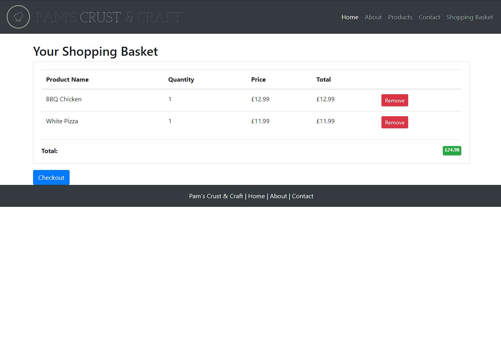

# QA Project: Pam's Crust and Craft

## Introduction

The "Pam's Crust and Craft" project involves the development of a simple CRUD (Create, Read, Update, Delete) application in Python. The primary functionality of this application is to manage a virtual shopping experience, allowing users to browse products, add them to their basket, simulate a sale, and view their order history. 
The application is built using the Flask micro-framework for the back end and utilises a MySQL database for data storage. 
The front-end components are powered by HTML, CSS, Bootstrap, and JavaScript.

The development of this application adheres to the Agile methodology, ensuring flexibility, collaboration, and iterative development to meet user requirements effectively.

# Table of Contents
[QA Project: Pam's Crust and Craft](#qa-project-pams-crust-and-craft)
   1. [Introduction](#introduction)
   2. [Functionality and Usage](#functionality-and-usage)
   3. [Technologies Used](#technologies-used)
   4. [File Explanation & Structure](#file-explanation--structure)
   5. [Development Process](#development-process)
      1. [Agile methodology](#agile-methodology)
      2. [Development Stages](#development-stages)
2. [Risk Assessment](#risk-assessment)

## Functionality and Usage
The application offers the following features:

- A visually appealing landing page with navigation links to different sections of the app.

- Users can browse products available in the menu section.

- Users can filter menu items by category, such as vegetarian options.

- Detailed information about a product, including its picture, description, and price.

- Adding and removing products from the basket. 

- Users can provide customer information, including name, last name, phone number, and email address, to proceed with the checkout process.

- Users can simulate the payment process by providing payment details.

- Users can view their last placed order and previous orders.

- A contact form enables users to send inquiries or feedback easily.

## Technologies Used
    Python version: 3.11.2
    Flask version: 2.2.3
    Jinja2 templating engine

all of the other necessary modules are defined in the requirements.txt file which can be executed with pip in order to install all of the dependencies: `pip install -r requirements.txt`

## File Explanation & Structure
file structure has been tested and allows for importing modules and classes across different .py files
- **app.py** is set up to act as the main program, so in order to start the app `py app.py` needs to be executed
	running this file will start the Flask development server on default port 5000
- **models.py** file contains all of the Python classes and their methods which define the structure of the database tables using SQLAlchemy:

	1. **Customer Class (`Customer`)**:
    
    - Represents the `customers` table in the database.
    - Contains attributes like `id`, `first_name`, `last_name`, `email`, `phone`, `address`, `card_number`, `card_expiry`, and `card_cvc` which correspond to customer information.
    - Provides methods:
        - `add_customer`: Adds a new customer to the database with the provided details.
        - `add_payment`: Updates the payment details (card information) of an existing customer.

	2. **Product Class (`Product`)**:
    
    - Represents the `products` table in the database.
    - Attributes include `id`, `product_name`, `description`, `price`, `img`, `veg`, and `available`, which store product information.
    - Provides methods:
        - `product_by_id`: Retrieves a product based on its `product_id`.
        - `all_products`: Retrieves all products in the database.
        - `veg_products`: Retrieves all vegetarian products.
	3. **Order Class (`Order`)**:
    
    - Represents the `orders` table in the database.
    - Attributes include `id`, `customer_id`, `order_date`, and `total_amount` to store order-related information.
    - Provides methods:
        - `add_order`: Adds a new order to the database.
        - `past_orders`: Retrieves all orders for a specific customer.
        - `last_order`: Retrieves the most recent order for a specific customer.
        - `specific_order`: Retrieves a specific order by its `order_id`.

	4. **OrderItem Class (`OrderItem`)**:
    
    - Represents the `order_items` table in the database.
    - Attributes include `id`, `order_id`, `product_id`, `quantity`, and `subtotal` for order item details.
    - Provides a method:
        - `ordered_items`: Creates and adds order items to the `order_items` table based on items in the user's basket.

	5. **BasketItem Class (`BasketItem`)**:
    
    - Represents the `basket` table in the database, which stores items that a customer has added to their basket before placing an order.
    - Attributes include `id`, `product_id`, and `quantity` for basket item details.
    - Provides methods:
        - `add_to_basket`: Adds a product to the user's basket.
        - `all_basket`: Retrieves all items in the user's basket along with their quantities.
        - `basket_total`: Calculates the total cost of items in the basket.
        - `empty_basket`: Removes all items from the basket.
        - `remove_basket`: Removes a specific product from the basket.

- **create.py** file is designed to populate database with initial data such as products
	the script initialises the database by dropping any existing entries, if there are any
	for the app to run successfully and allow basic product handling, this file needs to be executed prior to executing app.py `py create.py`

- **routes.py** file contains all of the necessary routes for this Flask app. each route defines the corresponding URL as well as functions associated with each route:
	1. **`/` (Home Page)**: Renders the `home.html` template, which  represents the main landing page of the website.
	2. **`/aboutus` (About Us Page)**: Renders the `about.html` template, providing information about the website and the company.
	3. **`/basket` (Basket Page)**: Renders the `basket.html` template, displaying the items in the user's basket.
    - Handles both GET and POST requests:
        - On a POST request, checks if the user clicked a "remove" button for an item and removes that item from the basket.
        - Redirects back to the basket page after removing an item.
	4. **`/contactus` (Contact Us Page)**: Renders the `contact.html` template, which  provides contact information for  the company.
	5. **`/checkout` (Checkout Page)**: Renders the `checkout.html` template, where users can provide their details for the order.
    - Handles both GET and POST requests:
        - On a POST request, processes the user's checkout information and redirects to the `payment` route.
	6. **`/payment/<int:customer_id>` (Payment Page)**: Renders the `payment.html` template, where users can provide payment details for the order.
    - Handles both GET and POST requests:
        - On a POST request, processes the payment information and updates the customer's details.
        - If payment is successful, adds the order to the database and clears the user's basket, then redirects to the `success` route.
	7. **`/success/<int:customer_id>` (Success Page)**: Renders the `success.html` template, displaying the user's past orders and showing the most recent order's details.
    - Retrieves past orders and the last order using the `Order` class methods.
	8. **`/products` (Products Page)**: Renders the `products.html` template, displaying a list of all available products.
    - Handles both GET and POST requests:
        - On a POST request, allows users to view product details or add products to the basket.
	9. **`/products/veg` (Vegetarian Products Page)**: Renders the `products.html` template, displaying a list of vegetarian products.
    - Handles GET requests:
        - Allows users to view product details or add products to the basket.
	10. **`/products/<product>` (Individual Product Page)**: Renders the `product.html` template, displaying details of an individual product.
    - Handles both GET and POST requests:
        - On a POST request, allows users to add the product to the basket.
	11. **`/order/<int:order_id>` (Order Page)**: Renders the `order.html` template, displaying the details of a specific order.
    - Retrieves order details and the items in that order using the `Order` and `OrderItem` class methods
    
- **__init__.py** file is the initialiser for the app as well as the database
	creates a Flask application, sets up a connection to a database using SQLAlchemy, and then initialises the application with the database extension
	please note that the database URI is stored as an environment variable and it is best practice to do so. this keeps sensitive information secure and separate from the code
- **application folder**
	- **static folder** stores all of the static files such as pictures, css styling `styles.css` file as well as JavaScript file `script.js`
	- **templates folder** Jinja2 is a templating engine that allows to embed dynamic content into HTML templates
	all of the HTML templates can be found in the templates folder 
	please note that by default Python will look for any templates in this folder - this is important if you intend to use functions such as `render_template`
- **tests folder** is the test suite for the app
	- **test_app.py** uses Python's pytest and flask_testing to test various views and functionality of the application 
		1. `TestBase` Class:
    
		    - Inherits from `flask_testing.TestCase`.
		    - Defines the `create_app()` method to configure the Flask app for testing.
		    - Implements `setUp()` to create test data in the database before each test case.
		    - Implements `tearDown()` to clean up the database after each test case.

		2. `TestViews` Class (Inherits from `TestBase`):
    
		    - Contains multiple test methods that correspond to different routes/views in the application.
		    - Each test method sends an HTTP request using `self.client.get()` or `self.client.post()` and asserts the expected response status code and content.

		The tests simulate user interactions with the application's views by sending GET and POST requests to various routes
		The POST request tests simulate form submissions and actions like adding items to the basket, removing items from the basket, checking out, and making a payment.

## Development Process

### Agile methodology
This project was developed using the Agile methodology, a dynamic and iterative approach to software development. Agile methodologies are designed to embrace change, promote collaboration, and enable the delivery of high-quality software in a flexible manner.

By embracing the Agile methodology, I aimed to create a development process that aligns with the evolving nature of software projects. This approach not only allows us to accommodate changes effectively but also enhances our ability to deliver a robust and user-centred product.

### Development Stages:
1. I carefully examined the brief and broken it down into components. This allowed me to identify the core features and functionalities required to meet the project's scope
	
	understanding the Minimum Viable Product (MVP) was central to this approach as it represents the essential set of features that deliver value to the users while allowing for a rapid launch
	
2. To maintain focus on the essential functionality, I established a Kanban board and categorised the requirements into user stories, tasks, and sprints.

	**Homepage:** As a user, I want the homepage to be visually appealing, so that I am drawn to explore the website and its offerings.
	- Design a visually appealing layout for the homepage.
	- Implement the homepage as the default landing page.
	- Create a navigation menu with links to other sections of the site.
	- Craft clear and concise content that communicates the site's purpose.
	- Select and integrate relevant product images and graphics.
	
	**Product Listing Page:** As a user, I want to view a list of all available products on the product listing page, so that I can quickly browse and select items of interest.
	- Design the layout for the product listing page.
	- Create a mechanism to retrieve and display a list of available products.
	- Incorporate product images, descriptions, and pricing into the listing.
	- Implement pagination or infinite scroll for efficient navigation.
	- Develop links to individual product pages for detailed information.
	
	**Category Page:** As a user, I want to see a display of product categories on the category page, so that I can easily find and explore products within specific categories.
	- Design the category page layout to showcase product categories.
	- Set up a system to organize and display products by category.
	- Create category filters or navigation elements.
	- Ensure that each category leads to a filtered product listing.
	
	**Basket Page:** As a user, I want to review the products I've added to my basket on the basket page, along with the total price, so that I can confirm my selections before proceeding.
	- Design the layout for the basket page.
	- Develop a mechanism to display selected products in the basket.
	- Calculate and display the total price of the items in the basket.
	- Implement the ability to modify product quantities.
	- Add a "Proceed to Checkout" button for streamlined purchasing.
	
	**Checkout Page:** As a user, I want to enter my shipping information and see a summary of my basket on the checkout page, so that I can complete my purchase with accurate delivery details.
	- Design the layout for the checkout page.
	- Display a summary of the products selected in the basket.
	- Create forms for users to enter shipping information.
	- Implement validation and error handling for the forms.
	
	**Payment Page:** As a user, I want to securely provide my payment details, including cardholder's name, card number, expiry date, and security code, on the payment page, to finalize my purchase.
	- Design the layout for the payment page.
	- Develop a secure form to collect payment details (name, card number, expiry, CVC).
	- Set up a mock external payment processor integration for testing.
	- Implement validation for payment details to ensure accurate information.
	
	**Contact Us Page:** As a user, I want to access store details such as address, phone number, and email on the contact us page, so that I can easily reach out to the store for inquiries or support.
	- Design the layout for the contact us page.
	- Display store details such as address, phone number, and email.
	- Create a contact form with fields for user inquiries.
	- Implement form validation and error messages.
	
	**About Us Page:** As a user, I want to read about the store's mission, history, and the team behind it on the about us page, so that I can better understand the business and its values.
	- Design the layout for the about us page.
	- Craft content that explains the store's mission, history, and team.
	- Develop sections that introduce key team members.

	Having a Kanban board that served as a dynamic hub for tracking progress while maintaining flexibility in managing requirements and priorities was key to delivering on time and in full 
	
    The board was regularly reviewed and updated in daily meetings 
	
    sprint 1 update:
    

    sprint 2 update:
    

3. Subsequently, I proceeded to outline a database structure. 
	Initially, I designed a set of tables that I deemed essential. However, this initial draft underwent iterations as I incorporated additional features into my application. Upon reviewing the screenshots below, you'll observe that my initial database lacked a basket table, as I initially intended to make use of Python lists for this purpose:

    

    Basket table added at a later stage:
    

    Using Python built-in sqlite enabled me to test various scenarios and input handling:
    

    I was eventually able to add some methods to the classes (tables) I created:
    

    Once I was happy with the design, I set up a connection to MySQL database instead of sqlite:
    

    The connection was successful and I was able to see changes made in my MySQL workbench:
    

4. In the meantime, I started designing the actual software, outlining its modules, classes, methods and routes:
	
    

    Thanks to my Kanban board, this process was  straightforward. The ability to focus on individual components one at a time allowed me to maintain a clear direction and streamline my efforts effectively.

    Throughout the process I encountered a number of issues that required closer attention and/or googling, some examples:

        Example 1: product name missing from the order page
    

    

        Example 2: grand total for the items in basket not working properly

    

    

        Example 3: at first I intended to connect to an open API in order to access publicly-available products and corresponding details, however I ran out of free requests very early in the process and decided to hard-code products into my database

    

    

        Example 4: app.py not working after connecting MySQL db until create.py has been executed:

    

5. While working on the code I started testing 

    Testing holds a crucial role within the agile methodology. Regular testing enables the timely identification of errors in the development process, leading to the preservation of the team's time and valuable resources. In the case of my application, initial testing involved manual procedures where uncomplicated test variables were formulated for input into functions or methods, as illustrated below:

    

    Afterward, I developed a test suite using the pytest framework, which played a pivotal role in automating the testing process and conducting an analysis of the code coverage achieved by the tests. This endeavor involved the integration of the pytest and flask_testing modules to construct the `test_app.py` file:

    

    `pytest` can be executed in the terminal by running:
    - `py -m pytest --cov=app` 
    - `py -m pytest --cov=app --cov-report html` to generate a thorough report which can be viewed as a HTML page

    below screenshot shows the latest coverage of 89% which is widely acceptable in the industry

    

6. The final phase encompassed minimising human intervention in both the development and testing of the application. 
    Fortunately, a range of alternatives exist for automating these processes. A widely adopted approach involves the utilisation of an automation server, with Jenkins being a prominent example.

    Upon configuring the Jenkins job appropriately, the responsibilities of building and testing were effectively transferred away from me. This shift enabled me to concentrate more on the coding aspect, as the automation framework consistently handled the tasks of building and testing, even for newly incorporated features.

    Screenshot below shows build steps set up for my project:
    

    I then added `py create.py` and `py app.py` to run my app on Jenkins server

    Lastly, screenshot below shows some successful builds as well as some saved arctifacts such as html coverage report

    

    ## Risk Assessment

| Risk Category         | Risk Description                                 | Mitigation Strategy                          |
|-----------------------|-------------------------------------------------|----------------------------------------------|
| Technical Risks       | Potential errors in the database                | Implement regular backups and monitoring.    |
|                       | Challenges in integrating different components  | Perform thorough testing and validation.    |
|                       | Difficulty in handling increased workload      | Choose a technology stack with scalability. |
|                       | Vulnerabilities leading to data breaches       | Implement secure coding practices and audits.|
| Development Risks     | Expanding scope beyond original requirements   | Define clear scope and prioritise features. |
|                       | User stories lacking critical information      | Create well-defined user stories.           |
|                       | Complex and convoluted code                     | Conduct code reviews and maintain simplicity.|
|                       | Insufficient testing leading to missed issues   | Plan comprehensive testing. |
| Time and Resource Risks| Overly optimistic timeframes                   | Allocate buffer time and plan realistically.|
|                       | Shortage of available resources                | Ensure availability and flexibility.    |
|                       | Delays in dependencies                          | Identify dependencies early and have backups.|
| Communication Risks   | Misunderstandings due to misaligned expectations| Maintain open communication and clear goals.|
|                       | Unclear communication leading to confusion    | Use effective communication channels.  |
| User Experience Risks | Poor user experience and usability              | Gather user feedback and iterate on design. |
|                       | Inconsistencies in the user interface          | Maintain consistent design language.   |
| Testing and Quality Risks | Insufficient test coverage                   | Plan and execute thorough testing scenarios.|
|                       | Test data not representative of real-world scenarios | Use representative test data for accurate testing.|
| Deployment and        | Challenges during deployment                   | Automate deployment processes and pre-test.|
| Maintenance Risks     | Difficulties in maintaining the application    | Document codebase and maintain clear comments.|
